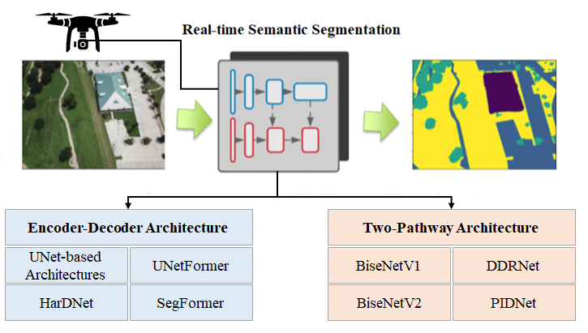
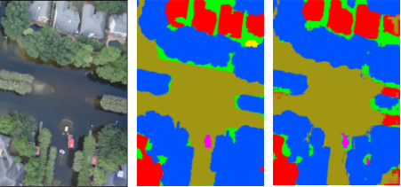

# FloodNet SegFormer: Real-Time Flood Scene Segmentation

[](https://doi.org/10.1109/JSTARS.2022.3219724)
[](https://www.python.org/)
[](https://pytorch.org/)
[](https://huggingface.co/docs/transformers/model_doc/segformer)

Implementation of **SegFormer for semantic segmentation of post-flood UAV imagery**, based on experiments reported in:

> **Comparative Study of Real-Time Semantic Segmentation Networks in Aerial Images During Flooding Events**  
> Farshad Safavi and Maryam Rahnemoonfar  
> *IEEE Journal of Selected Topics in Applied Earth Observations and Remote Sensing*, vol. 16, pp. 15–31, 2023  
> [Read the paper](https://doi.org/10.1109/JSTARS.2022.3219724) · [Citation](#citation)
>

## Study overview

<p align="center">
  
</p>

The study evaluates real-time encoder–decoder and multi-pathway semantic-segmentation architectures for rapid analysis of UAV imagery collected after flooding events.

## Highlights

- Supports **SegFormer-B0 through SegFormer-B5** using a single model option.
- Provides training, validation, checkpointing, and dataset-level segmentation metrics.
- Saves the dataset split, experiment configuration, metric history, and best Hugging Face checkpoint.
- Includes a compact [quick-start notebook](segformer_quickstart.ipynb) for learning and adaptation.
- Connects the implementation directly to the published real-time FloodNet benchmark.

## Real-time segmentation demo

<p align="center">
  <b>Input UAV footage (left) — SegFormer prediction (right)</b>
</p>

<p align="center">
  
</p>

<p align="center">
  <a href="assets/seg.mp4">▶ Watch the full-quality segmentation video</a>
</p>

## FloodNet dataset

This implementation uses **FloodNet**, a high-resolution UAV imagery dataset collected after Hurricane Harvey for post-flood scene understanding. FloodNet supports image classification, semantic segmentation, and visual question answering.

For semantic segmentation, the annotations contain **nine object classes plus background**, represented by ten label IDs:

| ID | Class | ID | Class |
|---:|---|---:|---|
| 0 | Background | 5 | Water |
| 1 | Flooded building | 6 | Tree |
| 2 | Non-flooded building | 7 | Vehicle |
| 3 | Flooded road | 8 | Pool |
| 4 | Non-flooded road | 9 | Grass |

The dataset is not redistributed in this repository. Download it from the official FloodNet repository:

- [FloodNet dataset and instructions](https://github.com/BinaLab/FloodNet-Supervised_v1.0)
- [FloodNet dataset paper](https://doi.org/10.1109/ACCESS.2021.3090981)

After downloading the dataset, organize the images and semantic masks as follows:

```text
FloodNet/
├── images/
│   ├── 0001.jpg
│   └── ...
└── masks/
    ├── 0001_lab.png
    └── ...

## Published benchmark

The following test-set result was reported in the 2023 paper. It is provided as a reference benchmark and **is not presented as a newly reproduced result from this cleaned implementation**.

| Model | Test mIoU | Pixel accuracy |
|---|---:|---:|
| **SegFormer-B0** | **61.6%** | **89.5%** |


### Flood-scene example



Example comparison of a flooded scene, its reference annotation, and the model prediction.

## Installation

```bash
git clone https://github.com/farshadsafavi/FloodNet-SegFormer-RealTime.git
cd FloodNet-SegFormer-RealTime

python -m venv .venv
source .venv/bin/activate  # Windows: .venv\Scripts\activate
pip install -r requirements.txt
```

## Training

Example: train SegFormer-B3 for 15 epochs.

```bash
python floodnet_segformer.py \
  --image-dir /path/to/FloodNet/images \
  --mask-dir /path/to/FloodNet/masks \
  --model-name nvidia/mit-b3 \
  --output-dir outputs/segformer-b3 \
  --epochs 15 \
  --batch-size 1
```

Choose a different backbone by changing `--model-name`:

| Variant | Hugging Face model name |
|---|---|
| SegFormer-B0 | `nvidia/mit-b0` |
| SegFormer-B1 | `nvidia/mit-b1` |
| SegFormer-B2 | `nvidia/mit-b2` |
| SegFormer-B3 | `nvidia/mit-b3` |
| SegFormer-B4 | `nvidia/mit-b4` |
| SegFormer-B5 | `nvidia/mit-b5` |

Run the following command to view every available option:

```bash
python floodnet_segformer.py --help
```

## Quick-start notebook

The [SegFormer quick-start notebook](segformer_quickstart.ipynb) provides a shorter interactive example for understanding and adapting the implementation before launching a full experiment.

## Repository structure

```text
FloodNet-SegFormer-RealTime/
├── assets/                      # README figures and demonstrations
├── CITATION.cff                 # GitHub citation metadata
├── floodnet_segformer.py        # Training and evaluation implementation
├── requirements.txt             # Python dependencies
├── segformer_quickstart.ipynb   # Interactive implementation example
└── README.md
```

## Citation

If you use this repository in academic work, please cite the paper:

```bibtex
@article{safavi2023comparative,
  author  = {Farshad Safavi and Maryam Rahnemoonfar},
  title   = {Comparative Study of Real-Time Semantic Segmentation Networks in Aerial Images During Flooding Events},
  journal = {IEEE Journal of Selected Topics in Applied Earth Observations and Remote Sensing},
  volume  = {16},
  pages   = {15--31},
  year    = {2023},
  doi     = {10.1109/JSTARS.2022.3219724}
}
```

GitHub also provides a **Cite this repository** option using [CITATION.cff](CITATION.cff).

## Companion repository

The U-Net models with MobileNetV2 and MobileNetV3 encoders evaluated in this study—and introduced in the earlier 2021 comparison—are available in [FloodNet-MobileNet-Segmentation](https://github.com/farshadsafavi/FloodNet-MobileNet-Segmentation).

## Acknowledgments

This repository uses the **FloodNet dataset**. Please cite the original FloodNet publication when using the dataset:

> M. Rahnemoonfar, T. Chowdhury, A. Sarkar, D. Varshney, M. Yari, and R. R. Murphy, “FloodNet: A High Resolution Aerial Imagery Dataset for Post Flood Scene Understanding,” *IEEE Access*, vol. 9, pp. 89644–89654, 2021. https://doi.org/10.1109/ACCESS.2021.3090981

The dataset and usage instructions are available from the [official FloodNet repository](https://github.com/BinaLab/FloodNet-Supervised_v1.0).

## License

The source code in this repository is available under the [MIT License](LICENSE).

The FloodNet dataset, published paper, pretrained model weights, and third-party assets remain subject to their respective licenses and terms of use.
