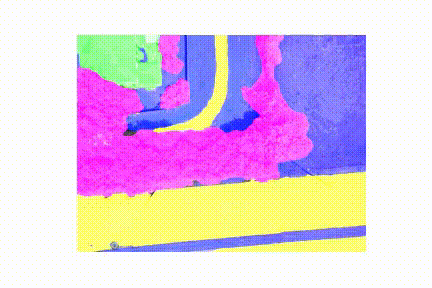

# FloodNet SegFormer: Real-Time Flood Scene Segmentation

[](https://doi.org/10.1109/JSTARS.2022.3219724)
[](https://www.python.org/)
[](https://pytorch.org/)
[](https://huggingface.co/docs/transformers/model_doc/segformer)


A clean, reusable implementation of **SegFormer for semantic segmentation of post-flood UAV imagery**, based on the experiments reported in:

> **Comparative Study of Real-Time Semantic Segmentation Networks in Aerial Images During Flooding Events**  
> Farshad Safavi and Maryam Rahnemoonfar  
> *IEEE Journal of Selected Topics in Applied Earth Observations and Remote Sensing*, 2023  
> [Paper](https://doi.org/10.1109/JSTARS.2022.3219724) · [Citation](#citation)

> [!NOTE]
> This repository is a **cleaned reimplementation** derived from the original experimental notebooks. It is not an archival copy of the exact environment used to produce the published results.

## Highlights

- Supports **SegFormer-B0 through SegFormer-B5** through a single configuration option.
- Includes training, validation, checkpointing, and dataset-level segmentation metrics.
- Saves the dataset split, experiment configuration, metric history, and best Hugging Face checkpoint.
- Provides a compact [quick-start notebook](segformer_quickstart.ipynb) for implementation and teaching.
- Connects the code directly to the published real-time FloodNet benchmark.

## Real-Time Flood Segmentation Demo

<p align="center">
  Side-by-side comparison of the original UAV footage and the corresponding SegFormer prediction.
</p>

<table>
  <tr>
    <th width="50%">Input UAV Footage</th>
    <th width="50%">SegFormer Prediction</th>
  </tr>
  <tr>
    <td align="center">
      
    </td>
    <td align="center">
      
    </td>
  </tr>
</table>

<p align="center">
  <a href="assets/seg.mp4">▶ Watch the high-quality segmentation video</a>
</p>

## Study overview


The study evaluates real-time encoder-decoder and multi-pathway semantic-segmentation architectures for rapid analysis of UAV imagery collected after flooding events.

## FloodNet dataset


FloodNet contains high-resolution UAV imagery annotated with ten semantic classes:

| ID | Class | ID | Class |
|---:|---|---:|---|
| 0 | Background | 5 | Water |
| 1 | Flooded building | 6 | Tree |
| 2 | Non-flooded building | 7 | Vehicle |
| 3 | Flooded road | 8 | Pool |
| 4 | Non-flooded road | 9 | Grass |

The dataset is not redistributed in this repository. Download FloodNet separately and arrange it as follows:

```text
FloodNet/
├── images/
│   ├── 0001.jpg
│   └── ...
└── masks/
    ├── 0001_lab.png
    └── ...
```

## Published result

The following test-set result is reported in the 2023 paper. It is included as a reference benchmark and is **not presented as a newly reproduced result** from this cleaned implementation.

| Model | Test mIoU | Pixel accuracy |
|---|---:|---:|
| **SegFormer-B0** | **61.6%** | **89.5%** |

### Qualitative comparison


The figure compares ground truth with predictions from the evaluated real-time architectures. See the [paper](https://doi.org/10.1109/JSTARS.2022.3219724) for the complete protocol, architecture comparison, and per-class results.

## Installation

```bash
git clone https://github.com/farshadsafavi/FloodNet-SegFormer-RealTime.git
cd FloodNet-SegFormer-RealTime

python -m venv .venv
source .venv/bin/activate  # Windows: .venv\Scripts\activate
pip install -r requirements.txt
```

## Training

Train SegFormer-B3:

```bash
python floodnet_segformer.py \
  --image-dir /path/to/FloodNet/images \
  --mask-dir /path/to/FloodNet/masks \
  --model-name nvidia/mit-b3 \
  --output-dir outputs/segformer-b3 \
  --epochs 15 \
  --batch-size 1
```

To use another SegFormer size, change `--model-name`:

| Variant | Model name |
|---|---|
| SegFormer-B0 | `nvidia/mit-b0` |
| SegFormer-B1 | `nvidia/mit-b1` |
| SegFormer-B2 | `nvidia/mit-b2` |
| SegFormer-B3 | `nvidia/mit-b3` |
| SegFormer-B4 | `nvidia/mit-b4` |
| SegFormer-B5 | `nvidia/mit-b5` |

Run `python floodnet_segformer.py --help` to view all available options.

## Quick-start notebook

The [SegFormer quick-start notebook](segformer_quickstart.ipynb) provides a shorter, interactive example for users who want to understand or adapt the implementation before launching a full experiment.

## Video demonstration

For a professional GitHub preview, convert a short result clip to an optimized GIF and save it as `assets/segmentation_demo.gif`. Then add the following line to this section:

```markdown

```

For a longer MP4 or YouTube video, use a clickable thumbnail instead of embedding the full movie directly in the README.

## Companion repository

The U-Net models with MobileNetV2 and MobileNetV3 encoders evaluated in this study—and introduced in the earlier 2021 comparison—are available in:

> [FloodNet-MobileNet-Segmentation](https://github.com/farshadsafavi/FloodNet-MobileNet-Segmentation)

## Repository structure

```text
FloodNet-SegFormer-RealTime/
├── assets/                      # README figures and demonstrations
├── CITATION.cff                 # GitHub citation metadata
├── floodnet_segformer.py        # Training and evaluation implementation
├── requirements.txt             # Python dependencies
├── segformer_quickstart.ipynb   # Compact implementation example
└── README.md
```

## Citation

If you use this repository in academic work, please cite the paper:

```bibtex
@article{safavi2023comparative,
  author  = {Farshad Safavi and Maryam Rahnemoonfar},
  title   = {Comparative Study of Real-Time Semantic Segmentation Networks in Aerial Images During Flooding Events},
  journal = {IEEE Journal of Selected Topics in Applied Earth Observations and Remote Sensing},
  volume  = {16},
  pages   = {15--31},
  year    = {2023},
  doi     = {10.1109/JSTARS.2022.3219724}
}
```

GitHub also provides a **Cite this repository** option based on [CITATION.cff](CITATION.cff).

## Acknowledgment

This repository uses the FloodNet dataset and pretrained SegFormer backbones distributed through the Hugging Face Transformers ecosystem. Please cite the original dataset and model publications when appropriate.

## License

No software license has been selected yet. Add a `LICENSE` file before encouraging redistribution or reuse of the code.
